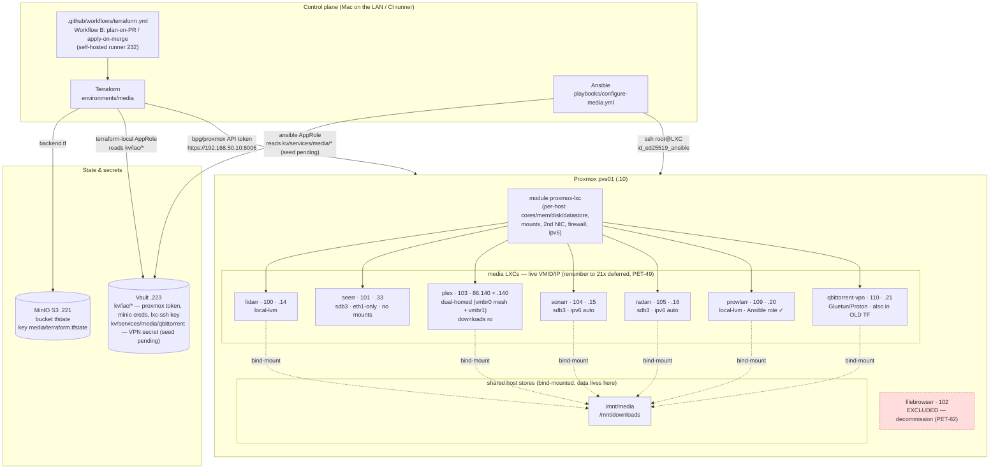

# Architecture — petedio-media-iac

How this repo's Terraform + Ansible map onto the live homelab media stack.
Brownfield **capture-in-place**: Terraform owns each LXC's existence/shape (imported
zero-drift), Ansible configures the running services idempotently. State lives in
MinIO; secrets in Vault. See [GOTCHAS.md](GOTCHAS.md) and [../CLAUDE.md](../CLAUDE.md).

## Legend / notes

- **Terraform** (`environments/media`) declares each LXC via the reusable
  `modules/proxmox-lxc`; the 7 hosts were `terraform import`ed to a **zero-drift**
  plan (PET-46). State key is isolated from `petedio-iac` (`media/terraform.tfstate`).
- **Ansible** configures the running services idempotently (PET-47). Only
  `prowlarr` has a role so far; the rest are follow-up. Reaches the LXCs over
  `id_ed25519_ansible` (bootstrapped additively via pve01 `pct exec`).
- **Secrets:** the Proxmox token / MinIO creds / LXC ssh key are the same
  `kv/iac/*` values `petedio-iac` uses (read via the `terraform-local` AppRole).
  The media-only VPN secret (`kv/services/media/qbittorrent`) is read by the
  `ansible` AppRole; **its seed is still pending** a privileged token — see
  [runbooks/qbittorrent-vault-secret.md](runbooks/qbittorrent-vault-secret.md).
- **Data safety:** the *arr/Plex media + downloads live on the shared host stores
  `/mnt/media` + `/mnt/downloads` (bind-mounts), so destroying/recreating a
  *container* never touches the data.
- **filebrowser (102)** is intentionally excluded and flagged for decommission (PET-82).
- **Renumber to the 21x block is deferred** (PET-49) — these are the live legacy VMIDs/IPs.
