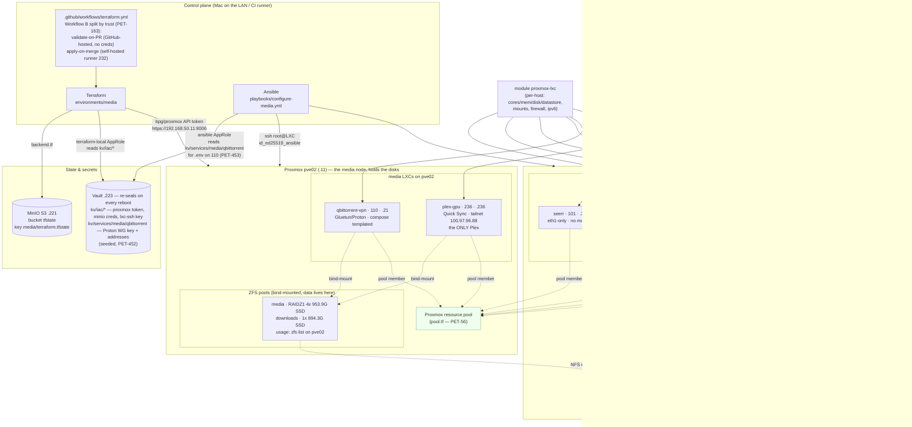

# Architecture — petedio-media-iac

How this repo's Terraform + Ansible map onto the live homelab media stack.
Brownfield **capture-in-place**: Terraform owns each LXC's existence/shape (imported
zero-drift), Ansible configures the running services idempotently. State lives in
MinIO; secrets in Vault. See [GOTCHAS.md](GOTCHAS.md) and [../CLAUDE.md](../CLAUDE.md).

## Legend / notes

- **Terraform** (`environments/media`) declares each LXC via the reusable
  `modules/proxmox-lxc`; the hosts were `terraform import`ed to a **zero-drift**
  plan (PET-46). State key is isolated from `petedio-iac` (`media/terraform.tfstate`).
  The import captured seven; `media.tf` declares **six** module blocks today — lidarr
  100 left in PET-319 and plex 103 died with pve01, and plex-gpu 236 was added.
- **Ansible** configures the running services idempotently (PET-47, **complete**).
  Roles: `media-base`, `servarr` (one parametrised role covering
  sonarr/radarr/prowlarr — lidarr left in PET-319), `plex`, `seerr`,
  `qbittorrent-vpn`, `media-lifecycle`. Reaches the LXCs over
  `id_ed25519_ansible` (bootstrapped additively via `pct exec` on the guest's
  node). The `plex` role updates **plex-gpu 236** since PET-394 — the play in
  `playbooks/media-roles.yml` names `hosts: plex-gpu`. It was hostless between
  103 dying and that change.
- **Secrets:** the Proxmox token / MinIO creds / LXC ssh key are the same
  `kv/iac/*` values `petedio-iac` uses (read via the `terraform-local` AppRole).
  The media-only VPN secret (`kv/services/media/qbittorrent`) is read by the
  `ansible` AppRole; **its seed is still pending** a privileged token — see
  [runbooks/qbittorrent-vault-secret.md](runbooks/qbittorrent-vault-secret.md).
- **Data safety:** the *arr/Plex media + downloads live on the shared host stores
  `/mnt/media` + `/mnt/downloads` (bind-mounts), so destroying/recreating a
  *container* never touches the data.
- **Pool membership** (`pool.tf`, PET-56) puts the six declared LXCs — 101, 104, 105,
  109, 110, 236 — in a Terraform-managed Proxmox resource pool. Add-only; it was the
  one change in the first real apply.
- **filebrowser (102)** is **decommissioned** — PET-82 is Done — but **VMID 102 is
  live**. The number was reused and 102 is flaresolverr on pve03 (`.150`, DHCP,
  deliberately unmanaged), which is what the diagram above shows. The app is gone;
  the number is not free. Neither is modelled in Terraform here.
- **The 21x renumber is canceled** (PET-49) — these legacy VMIDs/IPs are permanent,
  not an interim state waiting on a migration.
